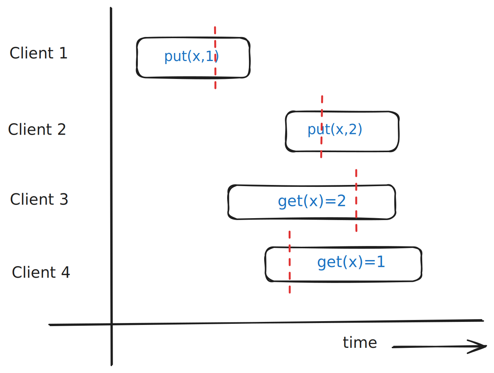

# Porcupine in Rust 🦀

A Rust implementation of the Porcupine linearizability checker.

Porcupine (original project: https://github.com/anishathalye/porcupine) is a fast linearizability checker used to test the correctness of distributed systems. This project reimplements the core ideas in Rust, with a focus on learning and design clarity rather than raw performance or feature parity.

This project exists for a few key reasons:

- Explore correctness in distributed systems through hands-on implementation
- Deepen Rust knowledge (this is my first Rust project)
- Emphasize clean design, separation of concerns, and testability
- Experiment with APIs and abstractions for modeling concurrent systems

# What is Linearizability?

A linearizability checker determines whether a concurrent history of operations can be explained as a valid sequential execution.

More concretely:

- You start with a history of operations (invocations and responses)
- Operations may overlap in time (i.e., run concurrently)
- The checker tries to find a sequential ordering of those operations such that:
    - The ordering respects real-time constraints (if one operation finishes before another starts, it must come first)
    - The sequence is valid according to the system’s specification

If such an ordering exists, the history is linearizable.

*This system is linearizable. The red lines mark the linearization points—the moments at which each operation appears to take effect atomically.*

# Inspiration

This project is based on the excellent work by Anish Athalye:

Porcupine: https://github.com/anishathalye/porcupine
