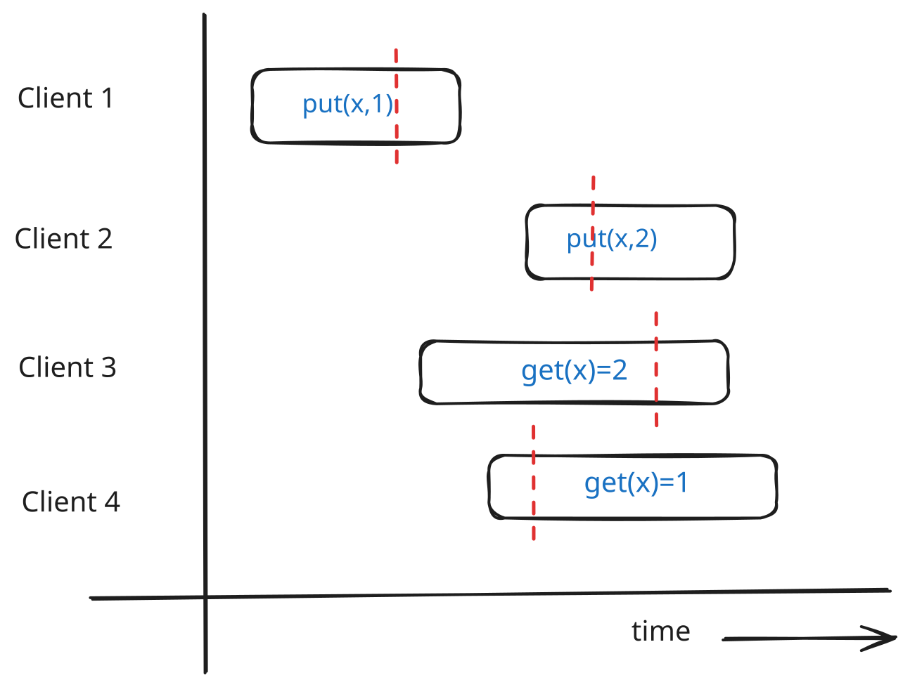
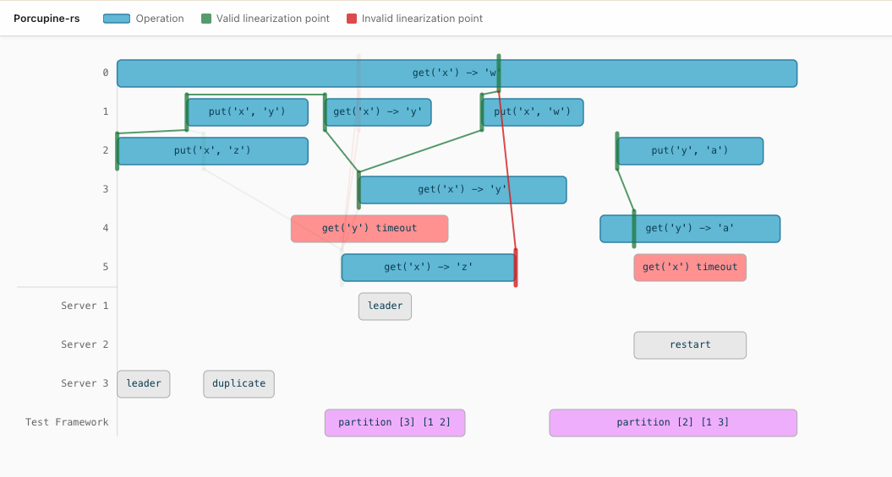

# Porcupine in Rust 🦀

[](https://github.com/erwin-kok/porcupine-rs/actions/workflows/ci.yaml)
[](https://www.rust-lang.org/)
[](https://github.com/erwin-kok/porcupine-rs/blob/master/LICENSE)
[](https://crates.io/crates/porcupine-rs)

A linearizability checker for distributed systems, reimplemented in Rust.

Based on the original [porcupine](https://github.com/anishathalye/porcupine) by Anish Athalye.

## What is linearizability?

Linearizability is a correctness condition for concurrent systems. It asks:

> *Can this interleaved, concurrent execution be explained as some valid
> sequential execution of the same operations?*

More precisely, a history is linearizable if there exists a total ordering of
all operations such that:

1. The ordering is consistent with the real-time order of non-overlapping operations.
2. Every operation in the ordering satisfies the system's sequential specification.

The points at which operations appear to take effect are called
**linearization points**.



*This history is linearizable. The red lines mark the linearization points —
the moments at which each operation takes effect atomically.*

## Algorithm

The checker uses the **WGL algorithm** (Wing & Gong, extended by Lowe) — a
depth-first backtracking search over the space of possible linearization
orderings.

At each step the search:

1. Scans the active history for an **eligible** operation.
2. Asks the model whether that operation is **accepted** from the current state.
3. If accepted, **lifts** (removes) it from the history, updates the model
   state, and recurses.
4. If the recursion fails, **backtracks**: restores the operation to the history
   and the model to its previous state, then tries the next candidate.

A **complete linearization** is found when the active history is empty —
every operation has been successfully placed in sequential order.

### Skip-list

Naïvely, lifting an operation from the history requires copying the remaining
slice — O(n) work per level of recursion for a search tree of depth n.

Instead, the history is maintained as an **index-based doubly-linked list**
(the skip-list). Lifting an operation removes its call and return entries
in O(1); restoring them on backtrack is also O(1). 

### Cache

The same `(set of remaining operations, model state)` pair can be reached via
many different orderings of earlier operations. Any linearization reachable
from this pair once is reachable the same way every time, so re-exploring it
is wasted work.

### Partitioning

Many models decompose naturally into independent sub-problems. A key-value
store, for example, has completely independent state per key: operations on
key `A` can never affect the linearizability of operations on key `B`.

The `Model` trait exposes a `partition_operations` method that splits a
history into independent sub-histories. Each sub-history is checked in
isolation, with its own search state and cache. 


# Installation

```bash
# Clone the repository
git clone https://github.com/erwin-kok/porcupine-rs
cd porcupine-rs

# Build
cargo build --release

# Run tests
cargo test
```

## Usage

### Define a model

A model defines the sequential specification of your system. Implement the
`Model` trait:

```rust
use porcupine::{Model, Operation};

#[derive(Clone, Debug)]
pub enum RegisterOp {
    Put(u32),
    Get(Option<u32>),  // carries the value the client observed
}

#[derive(Clone, Debug)]
pub struct RegisterModel;

impl Model for RegisterModel {
    type State    = u32;          // current value of the register
    type Op       = RegisterOp;
    type Metadata = ();

    fn init() -> u32 { 0 }

    fn step(state: &u32, op: &RegisterOp) -> (bool, u32) {
        match op {
            // A Put always succeeds and updates the state.
            RegisterOp::Put(v) => (true, *v),
            // A Get succeeds only if the observed value matches the current state.
            RegisterOp::Get(v) => (*v == Some(*state), *state),
        }
    }
}
```

### Check an operation history

An `Operation` records what happened (`op`), when it was invoked (`call_time`), and when it returned (`return_time`):


```rust
    fn put(client_id: u32, call: i64, ret: i64, v: u32) -> Operation<RegisterModel> {
        Operation {
            client_id: Some(client_id),
            call_time: call,
            return_time: ret,
            op: RegisterOp::Put(v),
            metadata: None,
        }
    }

    fn get(client_id: u32, call: i64, ret: i64, v: Option<u32>) -> Operation<RegisterModel> {
        Operation {
            client_id: Some(client_id),
            call_time: call,
            return_time: ret,
            op: RegisterOp::Get(v),
            metadata: None,
        }
    }

    let history = vec![
        put(0,  10, 100, 1),
        get(2,  80, 210, Some(2)),
        get(3, 110, 230, Some(1)),
        put(1, 120, 210, 2),
    ];

    assert!(porcupine::check_operations(&history));
```

### Check an event history

If you record call and return events separately (as produced by many testing frameworks), use the `EventModel` trait and `check_events`:

```rust
use porcupine::{Event, EventModel};

#[derive(Clone, Debug)]
pub enum RegisterInput { 
    Put(u32), 
    Get 
}

#[derive(Clone, Debug)]
pub enum RegisterOutput { 
    Put,      
    Get(Option<u32>) 
}

impl EventModel for RegisterModel {
    type Input  = RegisterInput;
    type Output = RegisterOutput;

    fn combine(input: &RegisterInput, output: &RegisterOutput) -> RegisterOp {
        match (input, output) {
            (RegisterInput::Put(v), RegisterOutput::Put)       => RegisterOp::Put(*v),
            (RegisterInput::Get,    RegisterOutput::Get(v))    => RegisterOp::Get(*v),
            _ => panic!("mismatched input/output"),
        }
    }
}

let history = vec![
    Event::Call   { client_id: Some(0), value: RegisterInput::Put(1), id: 0, metadata: None },
    Event::Return { client_id: Some(0), value: RegisterOutput::Put,   id: 0, metadata: None },
    // ...
];

assert!(porcupine::check_events(&history));
```

### With a timeout
 
```rust
use std::time::Duration;
use porcupine::CheckResult;
 
match porcupine::check_operations_timeout(&history, Duration::from_secs(10)) {
    CheckResult::Ok      => println!("linearizable"),
    CheckResult::Illegal => println!("not linearizable"),
    CheckResult::Unknown => println!("timed out — answer unknown"),
}
```
 
---
 
## API reference
 
| Function | Bound | Returns | Notes |
|---|---|---|---|
| `check_operations` | `M: Model` | `bool` | No time limit |
| `check_operations_timeout` | `M: Model` | `CheckResult` | Returns `Unknown` on timeout |
| `check_operations_info` | `M: Model` | `(CheckResult, LinearizationInfo<M>)` | Includes partial linearizations |
| `check_operations_info_timeout` | `M: Model` | `(CheckResult, LinearizationInfo<M>)` | With timeout |
| `check_events` | `M: EventModel` | `bool` | No time limit |
| `check_events_timeout` | `M: EventModel` | `CheckResult` | Returns `Unknown` on timeout |
| `check_events_info` | `M: EventModel` | `(CheckResult, LinearizationInfo<M>)` | Includes partial linearizations |
| `check_events_info_timeout` | `M: EventModel` | `(CheckResult, LinearizationInfo<M>)` | With timeout |
| `visualize` | `M: Model` | `io::Result<()>` | Writes HTML to any `Write` |
| `visualize_path` | `M: Model` | `io::Result<()>` | Writes HTML to a file path |
 
### `Model` vs `EventModel`
 
| | `Model` | `EventModel: Model` |
|---|---|---|
| History format | `Vec<Operation<M>>` | `Vec<Event<M>>` |
| Key types | `State`, `Op` | + `Input`, `Output` |
| Extra method | — | `fn combine(input, output) -> Op` |
| Partitioning | `partition_operations` | + `partition_events` |
 
Use `Model` when you build the operation history directly (call and return are
always paired). Use `EventModel` when your test harness produces separate call
and return events that must be matched by `id`.
 
---
 
## Project structure
 
```
src/
  bitset.rs               — fixed-size bitset (cache key)
  cache.rs                — memoization cache
  checker.rs              — check_operations, check_events, parallel driver
  lib.rs                  — public API
  linearization_info.rs   — LinearizationInfo, Annotation
  linearizer.rs           — Linearizer: try_linearize, lift, backtrack
  model.rs                — Model, EventModel, Operation, Event, CheckResult
  partition.rs            — CheckEntry, Partition, from_operations, from_events
  skip_list.rs            — O(1) doubly-linked list for lift/restore
  visualization.rs        — visualize, visualize_path
tests/
  register_model.rs       — single-register model tests
  etcd_jepsen.rs          — etcd model + jepsen data-file tests
  kv_log.rs               — key-value model + jepsen log-file tests
  demo.rs                 — set model, no-partition model
visualization/
  index.html              — HTML template (embedded at compile time)
  index.css               — stylesheet (embedded at compile time)
  index.js                — interactive visualizer (embedded at compile time)
```
 

## Visualizing histories




Use `check_operations_info` or `check_events_info` instead of the plain
`check_operations` / `check_events` variants.  They return a
`(CheckResult, LinearizationInfo<M>)` pair, and the `LinearizationInfo` is
what the visualizer needs.  Pass it to `porcupine::visualize_path` to produce
a self-contained HTML file you can open in any browser:
 
```rust
use std::path::Path;
use porcupine::CheckResult;
 
let (result, info) = porcupine::check_operations_info(&history);
 
porcupine::visualize_path::<RegisterModel>(&info, Path::new("out.html"))
    .expect("visualization failed");
```
 
The visualization is **interactive**:
 
- **Hovering** over an operation bar highlights the most relevant partial
  linearization that contains it, and shows a tooltip with the previous and
  new model state, plus the raw call/return timestamps.
- **Clicking** pins the selection so you can move the mouse freely without
  losing the highlighted linearization.  Click the background to deselect.
- **Valid linearization points** are shown as green vertical lines through
  the operation bars; **invalid** (attempted but rejected) ones are red.  The
  *jump to first error* link in the legend scrolls directly to the leftmost
  invalid point.
The visualization is by partition.  With the key-value model, for example,
each key's operations appear in their own independent row group.
 
For the descriptions in the tooltip to be meaningful, implement the optional
`describe_operation` and `describe_state` methods on your model:
 
```rust
impl Model for RegisterModel {
    // ...
    fn describe_operation(op: &RegisterOp) -> String {
        match op {
            RegisterOp::Put(v) => format!("put({})", v),
            RegisterOp::Get(v) => format!("get() → {:?}", v),
        }
    }
 
    fn describe_state(state: &u32) -> String {
        format!("value = {}", state)
    }
}
```
 
You can also attach **custom annotations** to the visualization — useful for
marking server-side events, leader elections, or test-framework milestones
alongside the client operations:
 
```rust
use porcupine::Annotation;
 
info.add_annotations(vec![
    Annotation {
        tag:         Some("server".to_string()),
        start:       50,
        end:         Some(50),
        description: "leader elected".to_string(),
        ..Default::default()
    },
]);
 
porcupine::visualize_path::<RegisterModel>(&info, Path::new("out.html")).unwrap();
```

## Limitations

- **No `NondeterministicModel`.** The Go original supports models whose `step`
  returns multiple possible next states.
- **Timeout is approximate.** The kill flag is checked at iteration boundaries,
  not at arbitrary points, so the actual wall time may slightly exceed the
  requested timeout.


# Inspiration

This project is based on the excellent work by Anish Athalye:

Porcupine (Go): https://github.com/anishathalye/porcupine
